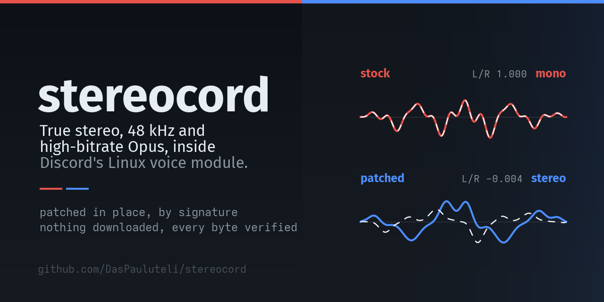
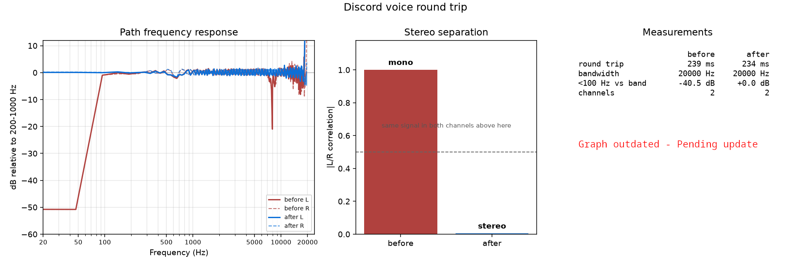
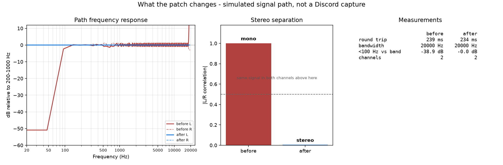

> **Warning**
> This modifies Discord's client files, which is against Discord's terms of
> service. Use at your own risk. Not affiliated with Discord Inc.

# stereocord

Forces true stereo, 48 kHz and a high Opus bitrate in Discord's Linux voice
module by patching `discord_voice.node`.

A Rust reimplementation of the Linux half of ProdHallow's
[Discord-Stereo-Windows-MacOS-Linux](https://github.com/ProdHallow/Discord-Stereo-Windows-MacOS-Linux),
which was discontinued in August 2026 (last functional commit `5e96ff0`). Same
set of patches, located differently.

## What it changes

| Group | Effect |
| --- | --- |
| stereo | SDP offers `stereo=1`; capture frames pinned to 2 channels; the capture-side mono downmix and the channel-downmix helper are bypassed; both Opus config constructors default to 2 channels |
| samplerate | 48 kHz on both arms of Discord's rate selection, instead of 32 kHz below the quality threshold |
| bitrate | 248 kbps (configurable) written into both config constructors *and* into the one wrapper every `opus_encoder_ctl(OPUS_SET_BITRATE)` call goes through, so nothing can walk it back |
| opus | 10 ms frames, `OPUS_APPLICATION_AUDIO` instead of VOIP, and config validation accepts the combination |
| celt | `MODE_CELT_ONLY` forced, so the encoder cannot drop into SILK/hybrid and reintroduce a low-pass or fold to mono |
| filter | WebRTC's high-pass filter returns immediately; libopus' `hp_cutoff` and `dc_reject` are replaced with a pass-through |

## Usage

```bash
cargo build --release
```

```bash
./target/release/stereocord scan
```

`scan` lists every Discord install, marks the one Discord will actually launch,
and reports whether each of the 18 patch sites can be located in that build.
Run it before patching — if a site is missing, say so rather than patching
around it.

```bash
./target/release/stereocord patch
```

Close Discord first. `patch` backs the module up, applies the edits, reads the
file back and verifies every byte landed. `--dry-run` shows the plan without
writing; `-v` prints every offset.

```bash
./target/release/stereocord restore
```

Puts the original module back. Backups live in
`~/.local/state/stereocord/backups/`, one per install, and are never
overwritten by an already-patched copy.

Other commands: `backups` lists what is on record, `shellcode` prints the
injected filter replacements as bytes, `scan --node <path>` inspects an
arbitrary `discord_voice.node` without touching any install.

Useful options: `-b/--bitrate <kbps>` (8–512, default 248), `-g/--gain <factor>`
applied by the injected filters, `-c/--client <text>` to narrow to one install,
`-a/--all` for every install rather than the newest per channel, `--allow-partial`
to apply the sites that did resolve on a build where some did not.

<!-- roundtrip:begin -->
## Before & after

A real round trip through a Discord call, between two Discord desktop clients
on separate machines: the probe goes into the sending client, out through
Discord's servers, and is recorded at the receiving end. Only the sender is
patched — the receiving client is a stock, unmodified install. Measured with
[`tools/roundtrip.py`](tools/roundtrip.py); see
[docs/measuring.md](docs/measuring.md) for the procedure.



| | before | after |
| --- | --- | --- |
| channels are | mono | **stereo** |
| L/R correlation | 1.000 | -0.004 |
| bandwidth | 20000 Hz | 20000 Hz |
| round trip | 239 ms | 234 ms |
| below 100 Hz | -40.5 dB | +0.0 dB |

The headline number is the L/R correlation. Two channels carrying the same
signal are mono however many channels the container claims.
<!-- roundtrip:end -->

## Validating the measurement



The second chart is **a simulation, not a Discord capture** — it says nothing
about any particular Discord build, and is here only to show that the analysis
behind the first chart works. It is the output of `python3
tools/roundtrip.py selftest`, which runs the same analysis over synthetic
recordings with known properties — one folded to mono and steeply high-passed,
one stereo and unfiltered — and checks that the measurement code recovers what
was put in.

The two charted cases are shaped like the capture above, so the pair should
look alike: full band on both arms, differing in channel count and in the low
end. A third case, not charted, is band-limited to 7.8 kHz to give the
bandwidth measurement a known cutoff to recover.

## Which clients can hear it

Stereo has to be negotiated by both ends. The patch only controls the sending
side, so what a listener actually hears depends on their client:

| Client | Receives stereo |
| --- | --- |
| Desktop (Linux / Windows / macOS) | yes — measured, on a stock client |
| Browser (discord.com) | no — reported not to negotiate stereo |
| Mobile | varies by client and version |
| Console | unverified |

A listener does not need the patch — the desktop client in the measurement
above was stock, and it decoded stereo because a desktop client negotiates it
when the sender offers it. What a listener needs is a client that negotiates
stereo at all: on one that does not, they hear mono no matter how well the
sending side is patched. This is also why a browser is useless as the receiving end of a
measurement: the result comes back mono and looks like the patch failed.

## Documentation

- [docs/how-it-works.md](docs/how-it-works.md) — how sites are located and validated, and what the injected filters do
- [docs/measuring.md](docs/measuring.md) — measuring the round trip through a real call

## How it differs from the original

**Sites are found by symbol first, signature second.** Every
`discord_voice.node` seen so far ships a full `.symtab` — around 64k function
symbols, covering the bundled Opus and WebRTC code by name and Discord's own C++
under its mangled names. Five sites are just a function entry, so a symbol
lookup is the whole job; the rest search a signature scoped to one named
function, which cannot match twice. A stripped build falls back to scanning the
whole file, which is why the signature catalogue is carried for every site.
`scan -v` reports how each site was resolved (`symbol`, `sig in <fn>`, `scan`).

**Signatures rather than hardcoded offsets.** The upstream project
shipped a table of file offsets per Discord build. When Discord shipped a new
one the offsets went stale, and the fallback was to download a known-good
`discord_voice.node` from GitHub and install it over the user's module. That
replaces the voice engine with one from a different Discord build — the patches
apply cleanly to a binary the rest of the client was never paired with.

Here each site is located by scanning for the instructions around it, so the
catalogue keeps working across builds and the module the user actually has is
the one that gets patched. Where a code sequence was rewritten between builds
the site simply lists both encodings; two sites in the capture path currently
need this. Nothing is ever downloaded.

**No compiler at install time.** Upstream generated a C++ file, compiled it with
whatever `g++`/`clang++` the machine had, and copied the resulting function
bodies into the binary — so the injected bytes depended on the host toolchain.
The two filter replacements here are emitted byte by byte (see
`src/shellcode.rs`), so the same input always produces the same patch and there
is no build dependency.

**It refuses rather than half-works.** Signature matches are checked against the
bytes each site expects before anything is written, every edit is read back
after, and a build where some site cannot be located is reported and skipped
unless `--allow-partial` is passed. A partial patch is how you get a client that
negotiates stereo and still sends one channel.

**It knows about staged updates.** Discord keeps each version in its own
`app-<version>` directory and downloads native modules into it separately. A
client that has staged an update has a new directory whose voice module is still
empty, so a patch applied to the previous directory silently stops applying at
the next restart. `scan` and `patch` both point this out; the default target is
the newest install per channel that has a module.

## Build coverage

| Build | Sites | Notes |
| --- | --- | --- |
| Stable 1.0.155 | 15/19 + 4 n/a | fully covered |
| Stable 1.0.153 | 18/19 + 1 n/a | fully covered |
| Stable 0.0.128–0.0.135 | 18/19 + 1 n/a | includes the build upstream last targeted, where every resolved offset matches its hardcoded table exactly |
| Stable 0.0.109, Canary 0.0.783 | 17/19 | mono-downmix site predates the code shape |

Not every site applies to every build, and "n/a" is different from "missing".
A site marked n/a is one this build does not need — either because another
patch already covers it, or because the construct it targets does not exist
here. Reporting those as failures would overstate how badly the catalogue has
aged.

1.0.155 rebuilt a good deal of the audio path. Both Opus config constructors are
inlined into their callers' stack frames (hence a second signature for the
inlined form), the `OpusEncoder` struct shifted by 4 bytes (hence wildcarded
field displacements in the CELT signatures), libopus gained
`opus_encode_frame_native`, and `hp_cutoff` / `dc_reject` are inlined into it.
That leaves no function to replace, so both filters are handled differently
there — see [docs/how-it-works.md](docs/how-it-works.md).

Sites are marked critical or not. The critical ones decide whether audio is mono
or stereo; the rest are quality refinements (bitrate, framing, CELT, filter
bypass). When only non-critical sites are missing the tool proceeds and says so.
When a critical one is missing it refuses unless `--allow-partial` is passed,
because a client that negotiates stereo and still sends one channel is worse
than one that does neither.

## Measuring whether it worked

The patch changes an encoder configuration; whether that reaches the person
listening is a separate question. `tools/roundtrip.py` sends a known probe
through a real call and measures what comes back — round-trip delay, L/R
correlation (the mono-versus-stereo test), effective bandwidth, and low-end
attenuation. See [docs/measuring.md](docs/measuring.md).

It needs a second endpoint in the call, because a client does not decode its own
transmission — and that endpoint has to be a Discord **desktop** client on
another machine, since the browser client will not negotiate stereo and Discord
refuses to run twice on one machine. It does not have to be patched; the
published measurement was taken against a stock receiving client.

The analysis itself is validated against synthetic recordings with known
properties — `python3 tools/roundtrip.py selftest` checks the recovered numbers
against the injected ones and exits non-zero if any drift. That is the second
chart above, and it is a simulation rather than a Discord measurement.

## Caveats

- A mono source still gives you two identical channels. Analysers report that as
  mono, correctly. Feed Discord a stereo input.
- Patching a running client does nothing: the old module is already mapped. The
  tool refuses unless `--force` is given.
- **A patched module blocks Discord's updates.** Discord ships voice-module
  updates as a binary delta and verifies the SHA-256 of the file it is about to
  patch. A patched module fails that check, which aborts the entire host update,
  so Discord goes on launching the old version and the staged `app-` directory
  sits half-populated — it looks like a stalled download. To take an update:
  `stereocord restore`, start Discord and let it update, quit, then
  `stereocord patch` again. `scan` detects this state and says so.
- Editing client files is against Discord's terms of service (see the warning at
  the top). Your account, your call.

## License

[CC BY-NC-SA 4.0](LICENSE) — Creative Commons
Attribution-NonCommercial-ShareAlike 4.0 International.

| | |
| --- | --- |
| modify and redistribute | yes, under the same license |
| commercial use | no |
| patent rights | not granted |
| attribution and this notice | required |

Copyright © 2026 Paul Neri
`<67437654+DasPauluteli@users.noreply.github.com>`. The notice is reproduced at
the top of every source file; keep it there if you copy any of this, and put
what you build on top of it under the same terms.

The license does not oblige you to publish source. If you ship a modified build
of a tool whose whole point is that you can check what it writes into someone
else's binary, publish the source anyway — that is a request rather than a
term, and it is stated as one in [LICENSE](LICENSE).
